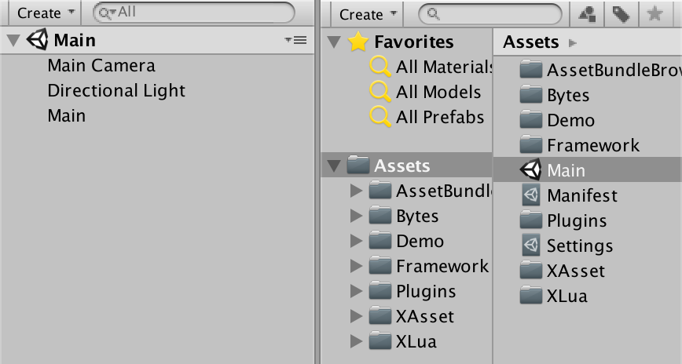

# emo

emo 是一个基于 xasset & xLua 的轻量客户端业务开发框架。xasset 是一个简易轻量的 Unity 资源管理框架，xLua为Unity、 .Net、 Mono等C#环境增加Lua脚本编程的能力，借助xLua，这些Lua代码可以方便的和C#相互调用。如果对 xasset & xLua 需要了解更多，请参考：

- xasset https://github.com/xasset/xasset
- xLua https://github.com/Tencent/xLua

## 基本介绍

emo 目前主要为 Unity 项目提供了一个基础的 Lua 业务开发环境，已经实现了：

- C# 与 Lua 的对接
- Lua 游戏视图管理、游戏状态管理、Action 组件等
  - MessageBox 功能演示
  - LoadingView 功能演示
  - GameState 功能演示
  - Action 功能演示
- Lua 代码以及视图 Prefab 一键打包和AB加载等

emo 未来也会会逐步引入代码热更、网络通信、版本更新，序列化等机制，感兴趣的可以先期待下。

## 入门指南

### 启动运行

emo 把 Main 场景，作为程序入口。Main 场景是一个简单的初始场景，位于 Assets 目录，如下：

启动后，通过挂载在场景中游戏对象 Main 上的 Main.cs 让 LuaManager.cs 进行初始化。

初始化主要是给 Lua 环境设置自定义加载器，在常规编辑器环境下，底层是直接通过系统 IO 库读取文件的二进制，在真实的AB加载环境下，则通过 xasset 提供的接口获取目标文件的二进制。

初始化后，LuaManager 会载入 Main.lua，并通过 Main.cs 把 cs 这边的一些主要的事件转发到 Main.Lua，至此，cs 程序的生命周期就与 Lua 环境对接上了。

### 业务开发

emo 的业务开发以 Lua 为主，所有 Lua 代码放在 Project 跟目录下与 Assets 同级的 Lua 目录下，如下：

emo 支持以直接编写 `.lua` 做开发，发布的时候，底层采用一键转换的方式，把 `.lua`文件一一对应的拷贝到 Assets/Bytes/Lua 下进行打包处理。

在 Lua 层，做业务开发的时候主要需要关注以下三个基础类型：

- View
- Action
- GameState

#### View 

View 是游戏视图的抽象，主要对外提供了创建/关闭/刷新等接口。

目前，工程中主要实现了以下 View：

 * UIRootView 所有 View 的根视图，其它 View 在创建后会放到该视图的 Canvas 节点上
 * MessageBox 通用对话框 View，可以设置标题、文本，按钮名称事件等
 * LoadingView 带进度条的 View，用来展示读条状态

如果需要添加新的 View 请仿照上面的 View 来实现。

View 的创建非常简单，以 MessageBox 为例，下面这段代码展示了 View 的创建过程：

```lua
local messageBox
local closeTime = 5
local context = {
    title = "MessageBox Test",
    text = string.format("This view will close after %.0f seconds", closeTime),
    ensureFunc = function() 
        messageBox:Close()
    end,
    cancelFunc = function() 
        messageBox:Close() 
    end,
    closeFunc = function() 
    		-- ...
    end
}
messageBox = MessageBox.new(context)  
-- messageBox.onloaded = function() ...  end
messageBox:Load(Res.prefab_message_box) 
```

从创建到关闭，都是直接通过 MessageBox 类构建对象的对象来操作，这样的设计自然是为了方便上手，不需要额外的理解 ViewManager 的逻辑。

#### Action

Action 主要用来处理一些需要更新并有完成条件的业务。

Action 主要需要关注以下接口：

- completed 完成后回调
- updater 每帧调用如果完成返回 true，没完成返回false

对于一个延时调用的 Action 可以这样构造：

```lua
function WaitForSeconds(seconds, completed, updated)
    return Action.new(function(action)
        if updated then
            updated(action)
        end
        return action.elasped >= seconds
    end, completed)
end
```

所以，如果 messageBox 打开后需要在 5 秒后关闭，可以这样实现：

```lua
messageBox.onloaded = function() 
    local lastRemainTime = closeTime
    local completed = function(view) 
        messageBox:Close()
    end 
    local updated = function (action) 
        local remainTime = closeTime - action.elasped
        if lastRemainTime - remainTime >= 1 then
            lastRemainTime = remainTime 
            local s = string.format("This view will close after %.0f seconds", remainTime)
            messageBox:SetContentText(s)
        end
    end 
    messageBox:RunAction(WaitForSeconds(closeTime, completed, updated))
end
```

让 View:RunAction 等于把 Action 的生命周期和 View 绑定，当 View 关闭时，通过该 View 启动的所有 Action 都会终止。这样就可以避免某个 Action 在 View 关闭后，继续访问 View 的属性出现异常报错的情况，程序自然会因此更稳健。

#### GameState

GameState 描述了程序在某个时间应在做什么，是对游戏生命周期中某个时间的抽象表示。

通常，游戏的生命周期可以抽象为多个 GameState，例如：初始化、读条、主界面、副本等。目前，在 emo 中，主要实现了以下状态：

* Initialize 系统初始化，UIRootView创建
* Loading 读条，处理版本更新，预加载等

如果需要添加新的GameState，也请仿照上面的 GameState 来实现，实现一个具体的 GameState 主要需要关注以下接口：

- OnEnter 进入这个状态该做什么
- OnUpdate 停留在这个状态每帧要做什么
- OnExit 退出这个状态该做什么

以 Initialize 为例，进入状态的时候，主要是把 UIRootView 创建出来，代码如下：

```lua
local M = class("Initialize", GameState)
local UIRootView = require "Logic/Views/UIRootView"

function M:OnEnter()
    local view = UIRootView.new()
    view.onloaded = function()
        Game.ChangeState(GameStateID.Loading)
    end
    view:Load(Res.prefab_uiroot)
end

function M:OnExit()
end

return M
```

上面的代码表示，当 UIRootView 加载出来后就切换当前游戏状态到 Loading 状态，状态切换的过程主要做了两件事：进入要切换的状态，和退出被切换的状态，代码如下：

```lua
function Game.ChangeState(newStateID)
    local stateName = GameStateNames[newStateID]
    local state = Game.states[newStateID]
    if not state then
        state = require("Logic/States/" .. stateName).new()
        Game.states[newStateID] = state 
    end
    local lastState = Game.state 
    if lastState then
        lastState:Exit()
    end
    Game.state = state 
    if state then
        state:Enter()
    end 
    print("[Game]ChangeState", stateName)
end
```

GameState 主要是为了让我们的程序结构变得更有条理也更好维护，对此如果还有疑惑，只需要记住开头那句话句话：**“GameState 描述了程序在某个时间应在做什么，是对游戏生命周期中某个时间的抽象表示”**。

### 资源打包

`Asset/AssetBundles/Build` 是 emo 在 xasset 的基础上，提供的针对 Lua 代码和预制件的批处理工具。

默认执行后，对于 Lua 代码，相同目录的文件会放到同一个资源分组，而对于预制件，每个文件都是一个独立的资源分组，具体可以参考：Packager.cs 类的 Build 方法，这里就不再细做说明。

## 技术支持

Email:xasset@qq.com

QQ群:693203087

## 优秀的Unity项目安利

- [TinaX Framework](https://tinax.corala.space/)： “开箱即用”的Unity独立游戏开发工具
- [QFramework](https://github.com/liangxiegame/QFramework) : 一套渐进式的快速开发框架
- [ET](https://github.com/egametang/ET):Unity3D Client And C# Server Framework

## 捐赠

